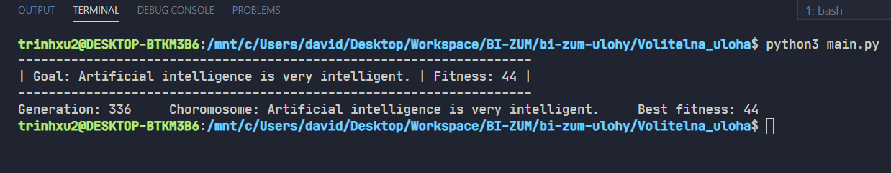

# Genetic Algorithm

## Assignment

The goal of this task is to use a genetic algorithm 

to evolve a randomly generated string to a user-inputted target string.

## Running the Program

### Requirements

To run the program, at least Python version 3.x.x is required.

### Output Description

- Goal - the target string that the user enters when initializing the genetic algorithm
- Fitness - the fitness value of the target string
- Generation - the current generation
- Chromosome - the genetic information of the strongest individual
- Best fitness - the fitness value of the strongest individual



### Demonstration

A video demonstration of the program's run can be found in the folder ./Volitelna_uloha/demo/demo.mp4

### Class StringEvolution

The StringEvolution class represents the genetic algorithm, taking the population size and reference string as parameters. The algorithm is then started using the start() method.
```python

# driver program

if __name__ == '__main__':

    StringEvolution(1000, "Artificial intelligence is very intelligent.").start()

```

## Individual

The individual is represented as a string of limited length, so the individual characters can be considered as genes, and the entire string as a chromosome.

```python
class Individual:

    def __init__(self, chromosome_size):

        # generate random chromosome of given length

        self.chromosome = [random.choice(StringEvolution.all_genes) for _ in range(chromosome_size)]

        self.chromosome_size = chromosome_size
```

## Initialization Operator

Uninformed initialization - each bit of genetic information of individuals is randomly selected from the set of allowed characters.

```python
class StringEvolution:

    # valid genes

    all_genes = string.ascii_letters + string.digits + string.punctuation + " "


    def __init_population(self):

        for _ in range(self.population_size):

            self.population.append(Individual(self.chromosome_size))

    ...


class Individual:

    def __init__(self, chromosome_size):

        # generate random chromosome of given length

        self.chromosome = [random.choice(StringEvolution.all_genes) for _ in range(chromosome_size)]

        self.chromosome_size = chromosome_size
```
## Fitness Function

The fitness function returns the number of matching characters in the individual's chromosome with the reference string, the higher the number, the stronger the individual.

```python
class StringEvolution:

    # fitness equals to number of common characters of chromosome and goal string

    def __fitness(self, individual):

        fitness = 0

        for cnt in range(self.chromosome_size):

            if self.goal[cnt] == individual.chromosome[cnt]:

                fitness += 1

        return fitness

    ...
```

## Operátor selekce

Ruletová selekce - pravděpodobnost výběru jedince je přímo úměrná jeho fitness, tedy pravděpodobnost výběru = (fitness jedince / fitness referenčního řetězce).

```python
class StringEvolution:

# selection is directly proportional to fitness

    def __roulette_wheel_selection(self):

        selected = []

        for individual in self.population:

            probability = self.__fitness(individual) / self.chromosome_size

            rand = random.random()

            if rand <= probability:

                selected.append(individual)

        return selected

    ...
```

## Operátor mutace

Bit-flip mutace - každý znak v chromozomu jedince má pravděpodobnost 10% na náhodnou záměnu za náhodný znak ze sady povolených znaků.

```python
class StringEvolution:

    # bit flip mutation

    def __mutate(self, individual):

        for i in range(self.chromosome_size):

            rand = random.random()

            if rand < 0.1:

                individual.chromosome[i] = random.choice(StringEvolution.all_genes)

    ...
```

## Operátor křížení

Uniformní křížení - v potomkovi je na dané pozici vybrán znak jednoho rodiče se stejnou pravděpodobností. 

```python
class StringEvolution:

    def __uniform_crossover(self, i1, i2):

        offspring = Individual(self.chromosome_size)

        for i in range(self.chromosome_size):

            rand = random.random()

            offspring.chromosome[i] = i1.chromosome[i] if rand <= 0.5 else i2.chromosome[i]

        return offspring

    ...
```

## Náhrada

Po křížení se k potomkům přidá X nejlepších jedinců z předchozí generace tak, aby počet jedinců v nové generaci odpovídal uživatelem nastavenému počtu jedinců v jedné generaci.

```python
class StringEvolution:

    def __replacement(self, offsprings):

        for i in range(self.population_size - len(offsprings)):

            offsprings.append(self.population[i])

        self.population = offsprings

        self.population.sort(key=self.__fitness, reverse=True)

    ...
```

